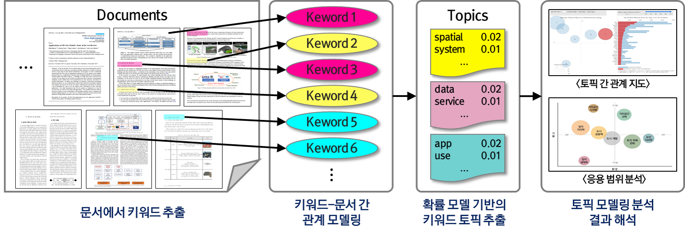
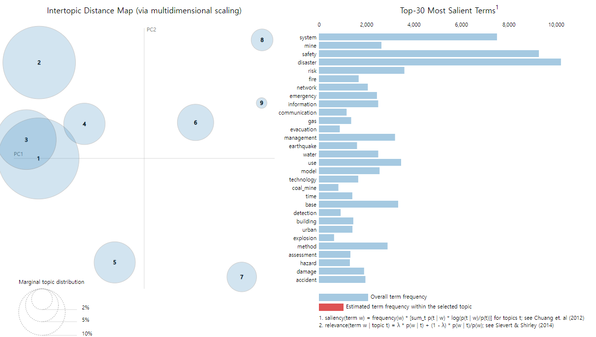

# Python을 활용한 LDA 토픽 모델링

 

## 의존성(Dependency)

- Python 3.8.16
- pip 23.0
- setuptools 58.1.0
- nltk 3.8.1
- gesim 3.8.3
- spacy 3.5.0
- pyLDAvis 3.3.1
- numpy 1.24.1
- pandas 1.5.3
- matplotlib 3.8.3

 

## 01. 데이터 수집(Data Collection)

**데이터 수집**은 '특정 응용 분야의 서비스 활용에 필요한 데이터를 시스템 또는 응용 프로그램에서 주기성을 갖고 필요한 형태로 수집하는 활동'으로 정의된다. 데이터 수집을 위해서는 응용 분야, 데이터 위치, 주기성, 저장형태 등을 고려해야 한다.

- **응용 분야**: 데이터 분석을 수행하기 위한 응용 분야 또는 목적을 선정해야 한다.
[ex: 디지털 트윈, 공간정보, 스마트시티 등]
- **데이터 위치**: 수집 데이터의 위치에 따라 구축하려는 시스템 내부 혹은 외부의 데이터로 나눌 수 있다.
[ex: 내부(Local...) 또는 외부(KCI, WoS 웹사이트 ...)]
- **주기성**: 데이터 수집의 주기성을 나눌 때 특정 시점(1991-01 ~ 2023-02) 또는 실시간 등과 같이 주기를 결정해야 한다.
- **수집 데이터의 저장형태**: 특정 응용 목적에 따라 데이터 위치, 주기, 수집방법 등을 결정하였으면, 수집한 데이터를 처리/분석/시각화를 위해 어떠한 형태로 저장할 것인지를 고려해야 한다.
[ex: DBMS 또는 CSV, Json 등]

 

## 02. 데이터 전처리(Data Pre-processing)

**데이터 전처리**는 특정 응용 분야에 적절한 데이터를 가공하는 작업을 의미한다. 수집된 데이터를 활용한 분석에서 불필요한 정보, NAN 값 등이 존재하여 실제 분석 결과의 신뢰도에 큰 영향을 미칠 수 있기 때문에 자연어 처리에서 가장 중요한 절차이다(Park et al., 2019). 

- **소문자 변환(Lower Case)**: 소문자 변환은 문서 내 동일한 단어가 다르게 표기(Disaster vs disaseter)되었다는 이유로 서로 다른 키워드로 카운팅되는 오류를 해결하기 위한 과정이다.
- **표준화(Standardization)**: 표준화는 문서 내 키워드에서 숫자, 구두점 등을 포함한 동일한 의미의 키워드를 하나의 용어를 치환한느 것으로써, "3-dimension", "3-D" 등과 같은 용어를 표준화된 형태인 "3D"로 변환하는 것이다.
- **토큰화(Tokenization)**: 토큰화는 주어진 말뭉치(Corpus)에서 토큰이라 불리는 단위로 분리하는 전처리 과정을 의미한다.
- **불용어 처리(Stopword Remove)**: 불용어 처리는 문서 내 존재하는 의미없는 단어들을 제거하는 전처리 과정이며, 문장 내에서 출현빈도가 높으나 분석에 불필요한 단어를 제거하는 과정이다.
- **어간(Stemming) 및 표제어(Lemmatization) 추출**: - 명사, 동사, 과거형 등 다양한 형태의 단어들을 원형 단어로 변환하는 것을 의미한다. 가령, history와 historical 등과 같은 동일한 키워드의 원형을 추출하기 위해 활용된다.

 

## 03. LDA 토픽 모델링(Topic Modeling)

**토픽 모델링**은 Blei et al.(2003)이 제안한 텍스트 마이닝(Text Mining) 기법의 한 종류로써, 비구조화(Unstructured)된 대량의 문서(Documents) 내 숨겨진 주제(Topic)을 추출하기 위한 확률 모델 알고리즘이다.

토픽 모델링은 '의미는 관계적이다.'라는 전제로 알고리즘을 수행하는데, 단어 자체의 의미가 아닌 문서 내 키워드 간의 동시 발생(Co-Occurrence)하는가를 측정하여 분석 대상(ex: 디지털 트윈, BIM, 공간정보 등 분야)에 대한 주제를 도출이 가능하다. 이렇게 토픽 모델링에서 잠재 디클레 할당(LDA, Latent Dirichiet Allocation)은 가장 널리 알려진 방법으로써, 시간의 흐름에 따라 특정 주제와 관련된 연구 동향을 파악하는데 유용하게 활용되고 있다(Park et al., 2019).

  

LDA 토픽 모델링 분석은 연구자가 설정한 토픽 모델, 주제 수 등에 따라 분석 결과 값이 상이하게 해석될 수 있으며, 이에 따라 분석 결과가 잘 도출되었는지 성능을 평가하는 것이 중요한 요소이다. LDA 토픽 모델링의 성능을 평가하는 기법으로 Perplexity와 Topic Coherence가 있다.

- **혼란도(Perplexity)**: 특정 확률 모델이 실제로 관측값을 얼마나 잘 예측하는지를 평가할 때 사용한다. Perplexity의 값이 작으면 작을수록 토픽 모델은 실제 문헌 결과를 잘 반영한다는 뜻으로 학습이 잘 되었다고 평가될 수 있다. 그러나, Chang et al.(2009)에 따르면 Perplexity의 값이 항상 용이한 결과값으로 해석될 수 없다는 한계를 제시하였다.
- **주제 일관성(Topic Coherence)**:  Newman et al.(2010)은 Perplexity의 한계를 극복하고 해당 확률 모델이 의미론적인 결과를 도출할 수 있는 척도를 평가하기 위해 제시하였다. Topic Coherence의 값이 높을수록 의미론적으로 일관성 있는 최적의 주제 개수로 선정할 수 있다.

 

## 04. LDA 토픽 모델링 시각화(Visualization)

**시각화**는 방대한 양의 데이터를 이해하고 변수 간의 관계를 통한 분석 결과를 차트(chart), 플롯(plot) 등과 같은 그래프(graph) 형태로 표현하는 방법이다. LDA 토픽 모델링에서 시각화는 데이터를 탐색하여 사용자에게 분석 결과를 효율적으로 전달하기 위한 목적 뿐만 아니라 정확한 분석 결과가 도출되었는지 탐색하기 위한 방법으로 활용된다.

 

### 05. LDA 토픽 모델링 시계열 추이 분석

**[추후 작업]**

 

### 참고문헌(Source)

> 1) Topic modeling with Gensim(Python) DOI: https://www.machinelearningplus.com/nlp/topic-modeling-gensim-python/
> 2) DATA ON-AIR/데이터 수집 개요 DOI: https://dataonair.or.kr/
> 3) Park et al., 2019, The Topic Modeling Analysis of The DMZ Tour IssuesUsing Text Mining
> 4) Chang et al., 2009, Reading tea leaves: How humans interpret topic models. In Advances in neural information processing systems
> 5) Newman et al., 2009, Automatic Evaluation of Topic Coherence
> 6) [Mecab install] DOI: https://sigirace.github.io/knowledge/colab_mecab/